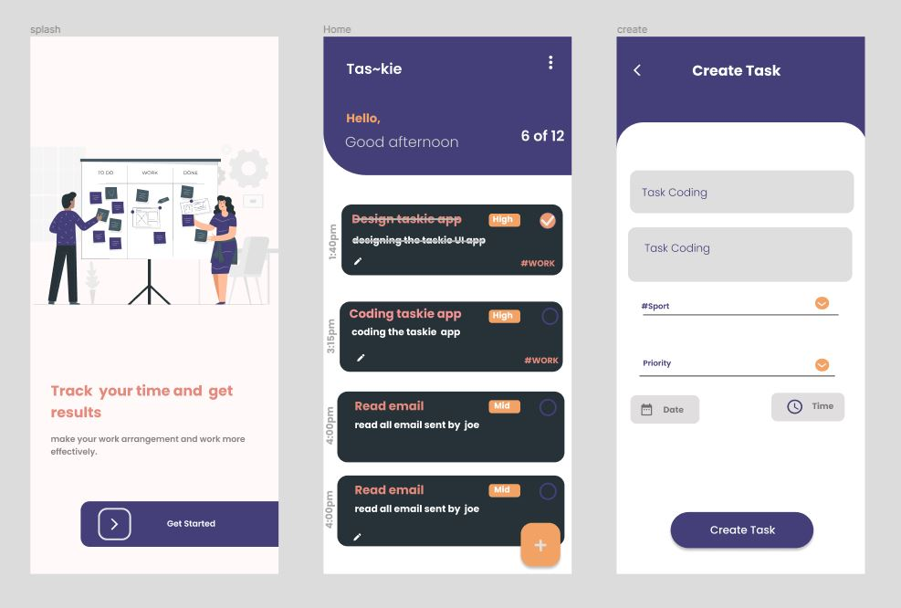

# taskie
 Simple task management app with flutter
 
 <h1>Tech used</h1>
 <ol>
  <li>Flutter and dart</li>
  <li>Flutter_bloc</li>
  <li>Firestore</li>
</ol>

<h2>Installing App</h2>
 <ol>
 <li>cd taskie</li>
  <li>cd taskie</li>
  <li>flutter pub get</li>
  <li>flutter run --release</li>
</ol>
 
<h1>Taskie Design</h1>

